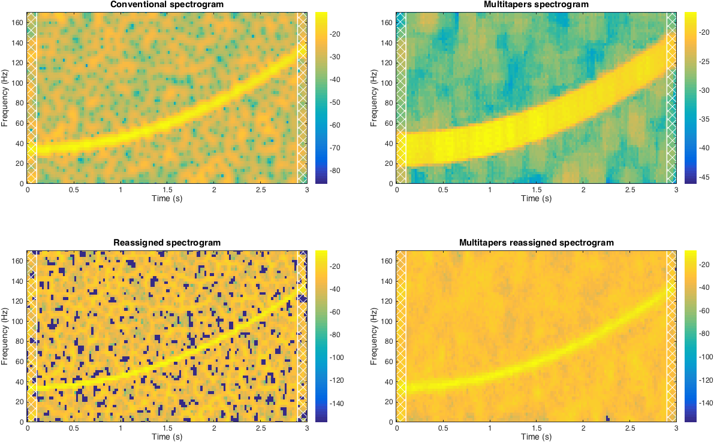

# Spectrogram reassignment

This function computes reassigned version of the conventional and multitaper spectrograms. The algorithm is based on Auger and Flandrin method [1], some parts are adopted from Fulop & Fitz [2]. The idea is to first compute conventional spectrogram, then find optimal (in a sense of energy) time and frequency positions and reassigns values in the spectrogram to this new positions. The difference between conventional and multitaper spectrograms is that multitaper method computes additional spectrogram with each taper. Taper is a generic term for a window function but in this method tapers refer to Slepian sequences [4]. As a result, generally multitaper spectrogram reveals less variance than conventional one.

Choice of tapers plays important role in the result. Two important parameters here are time-halfbandwidth product NW and number of tapers K. NW represents the trade-off between better localisation and less variance: the higher NW the less variance is in the resulting time-frequency representation, but the resolution is decreasing and vice versa. As a rule of thumb, number of tapers is chosen as K = 2NW-1.

Use `reasmultitapers` for multitaper reassignment and `reasspecgram` for conventional spectrogram reassignment. Both functions take standard inputs, e.g. signal, window/tapers, amount of zero-padding etc. You can also provide additional properties to the function. The detailed description of the properties are below and the full list with possible values is in [Syntax section](##Syntax).

You have a choice between reassigning spectrogram either as short-time Fourier transform (STFT) or power spectrum density (STFT normalized by window energy and sampling rate). Controlled by `psd` property.

You can pre-process signal by padding it. Several types of padding are available: with zeros, with a constant, periodical and symmetrical padding. This can be done by providing a type of padding in `pad` property.

Sometimes, extreme values (outliers) appear on a spectrogram (reassigned and original), for instance, when using too many overlapping points between the segments. You can `crop` them by providing to a desired value of percentile of the data, above which all the values will be set to the highest values. It works similarly to thresholding. To use this feature specify percentile as `crop` property.

It is possible to obtain spectrogram on finer grid with this method. For that, you have to specify in the properties three additional parameters: new steps or new dimensions of time and frequency, specify if it is new steps or dimensions. Usage of this feature is not recommended, because even though it is possible to increase number of points in the output matrix the original number of points is not changing. So, you might obtain very sparse matrix. To partially solve it you can use interpolation (set `interp` parameter), which interpolates additional points with values of its neighbouring points. A use of this feature is also not advised, because it decreases the sharpness of reassigned spectrogram and contradicts the whole idea of the reassignment.

There is one additional parameter for multitaper method: `mean`, which defines which method to use when averaging several spectrograms obtained with different tapers into one single distribution. Possible options are: standard mean function ('mean'), geometric mean ('geom') ,by choosing the minimal value along all the spectrograms ('min') or using median ('median'). For more information on different averaging methods see Xiao & Flandrin [3].


# Syntax
Conventional spectrogram:    
```RS = REASSPECGRAM(SIG,WIN,OVLAP,NFFT,FS,'PROPERTYNAME',PROPERTYVALUE)```   
Multitapers spectrogram:   
```RS = REASMULTITAPERS(SIG,NSEQ,TAPERS,OVLAP,NFFT,FS,'PROPERTYNAME',PROPERTYVALUE)```   
```matlab
RS = REASSPECGRAM(...,PROPERTYSTRUCTURE)
[RS,S] = REASSPECGRAM(...)
[RS,FNEW,TNEW] = REASSPECGRAM(...)
[RS,FNEW,TNEW,S,FORIG,TORIG] = REASSPECGRAM(...)
```

|Inputs |                   |
|-------|-------------------|
|SIG    | analysed signal, length of the signal is `N` points. |
|WIN    | **(spectrogram only)** smoothing window. If `WIN` is a vector, the signal `SIG` is divided into segments of length equal to the length of the window, and each segment is filtered with `WIN`. If `WIN` is an integer, then `SIG` is divided into segments of length equal to the specified integer and filtered with Hamming window. If no window is provided, then Hamming window of length `N`/10 is used by default. |
|NSEQ   | **(multitapers only)** length of tapers in samples. If no `NSEQ` is provided, then default value is `NSEQ` = `N`/10. |
|TAPERS | **(multitapers only)** taper functions, can be in one of the two forms: (1) As a vector [`NW` `K`], where `NW` is a time half bandwidth product and `K` is a number of tapers. `NW` must be strictly less than `NSEQ`/2 and `K` is usually chosen to be 2NW-1 (to provide good energy concentration). (2) Slepian sequences (e.g. obtained from MATLAB dpss function). Should be a matrix with `NSEQ` rows and `K` columns, where `K` is a number of tapers. |
|OVLAP  | number of overlapping points between two adjacent windows. Is used to compensate energy loss at the ends of smoothing windows. Should be specified as an integer smaller than the length of the window. If no `OVLAP` is given, the default value is used to obtain overlap of 50%. |
|NFFT   | number of Fourier transform points. If no input is provided, the default value is chosen to be equal to next power of 2 greater then the length of the window. |
|FS     | sampling frequency in Hz.|

|Outputs |                   |
|--------|-------------------|
| RS     | A matrix with reassigned spectrogram. Here, rows are frequencies and columns are time points.|
| S      | A matrix with original (not reassigned) spectrogram. Here, rows are frequencies and columns are time points. |
| FNEW   | Frequency vector corresponding to rows in reassigned spectrogram matrix. |
| TNEW   | Time vector corresponding to columns in reassigned spectrogram matrix. |
| FORIG  | Frequency vector corresponding to rows in spectrogram matrix. |
| TORIG  | Time vector corresponding to columns in spectrogram matrix. |

|Property  | Possible values      | Description |
|----------|----------------------|-------------|
| 'psd'    | boolean | If true, power spectral density (PSD) is reassigned. If not, squared absolute value of short-time Fourier transform is used. |
| 'pad'    | 'zeros' , 'const' , 'periodic' , symmetric' | If specified before processing a signal will be padded according to the chosen method. Padding can be done with zeros ('zeros'); with constant  equal to the first and last values of the signal ('const'); 'periodic' padding continues signal in both directions periodically; 'symmetric' reflects signal symmetrically on both sides. If padding is chosen it is added on both slides, the length of the padding is half of the window length. |
| 'crop'   | boolean | Sometimes there might be extreme values in the final TFR matrix. You can "crop" such values, by specifying percentile, above which the values should not be considered (by analogy with outliers); value of 99.5-99.9% is reasonable. |
| 'size'   | 2-element vector| You can change the size of the output TFR matrix.  Specify a new size as two-element vector: number of rows (frequency) and number of columns (time). Not recommended, because the number of elements in the original TFR matrix is fixed. |
| 'step'   | 2-element vector| Similar to 'size' parameter, but instead of specifying new size you provide new frequency and time sampling steps. |
| 'interp' | boolean | Interpolate neighbouring points. Can be useful when using new size/sampling, because it increases the number of points.  Otherwise, it is not recommended to use it, because the idea of reassignment is lost when interpolating. |
| 'mean'   | 'mean' , 'geom' , 'min' , 'median' | Method of averaging spectrograms obtained with multitapers into one time-frequency representation. |

By default all properties are unset. Property can be passed as name-value pair
or as a structure. If field requires logical true/false input, every non-empty,
finite and not 'NaN' input is treated as logical true, e.g. true, 'yes', 1
etc. will be validated as logical true.

I also provide a function to display the spectrogram `plot_spectro`. Default plot is done just by running the function with default inputs (time, frequency, TFR-matrix). You can provide additional parameters to the function as name-value pair of as a structure to modify the plots, e.g. change colormap, plot frequencies or power in dB, increase font size of the axes, etc. For more information `help plot_spectro` and see example code below.

## Example
This code can be found as a script in 'example' folder.

```matlab
% to get the same results
rng('default');

% construct a test signal
N  = 1024;          % number of points
T  = 3;             % total time
fs = N/T;           % sampling rate
dt = 1/fs;          % sampling step
t  = 0:dt:T-dt;     % time vector
x  = chirp(t,0.1*fs,t(end),0.4*fs,'quadratic')';
x  = x + 0.5*randn(size(x));

% spectral parameters
df    = 5;                    % desired frequency resolution
Nw    = floor(fs/df);         % window/slepian sequences length
ovlap  = floor(0.9*Nw);       % overlap between adjacent windows
nfft  = 2^nextpow2(Nw);       % number of FT points
win    = gausswin(Nw,2.5);    % window for spectrogram
tapers = [3.5, 6];            % tapers for multitaper NW = 3.5; K = 6

% set additional parameters:
% - return PSD estimate;
% - padd with zeros on both sides of the signal;
% - mean averaging of tapers;
% - interpolate reassigned points for spectrogram (to cover the "holes").
optsMulti = struct('psd',1,'pad','zeros','mean','mean');
optsSpec  = struct('psd',1,'pad','zeros','interp',1);

% time-freuqency representations
[RSmulti, fRMulti, tRMulti, Smulti, fMulti, tMulti] = reasmultitapers(x,...
    Nw,tapers,ovlap,nfft,fs,optsMulti);
[RSpec, fRSpec, tRSpec, Spec, fSpec, tSpec] = reasspecgram(x,...
    win,ovlap,nfft,fs,optsSpec);

% plot
figure; 
hf = gcf;
hf.Units = 'centimeters';
hf.Position(3:4) = [2.5*hf.Position(3) 2*hf.Position(4)];
ha1 = subplot(221); ha2 = subplot(222); ha3 = subplot(223); ha4 = subplot(224); 
set([ha1,ha2,ha3,ha4],'Units','centimeters');

% plot non-linear power and linear frequencies using 'image' function, plot COI,
% increase default font size and plot in each subplot
optsPlot = struct('type','image','dbFreq',0,'dbPow',1,'Nw',Nw,'tReal',t,...
    'font',12,'hax',ha1);
plot_spectro(tSpec,fSpec,Spec,optsPlot);
title('Conventional spectrogram','FontSize',15);

optsPlot.hax = ha2;
plot_spectro(tMulti,fMulti,Smulti,optsPlot);
title('Multitapers spectrogram','FontSize',15);

optsPlot.hax = ha3;
plot_spectro(tSpec,fSpec,RSpec,optsPlot);
title('Reassigned spectrogram','FontSize',15);

optsPlot.hax = ha4;
plot_spectro(tRMulti,fRMulti,RSmulti,optsPlot);
title('Multitapers reassigned spectrogram','FontSize',15);
```



## References
1. Auger, F. et al. Time-Frequency Reassignment and Synchrosqueezing: An Overview. IEEE Signal Processing Magazine 30, 32–41 (2013).
2. Fulop, S. A. & Fitz, K. Algorithms for computing the time-corrected instantaneous frequency (reassigned) spectrogram, with applications. The Journal of the Acoustical Society of America 119, 360 (2006).
3. Xiao, J. & Flandrin, P. Multitaper Time-Frequency Reassignment for Nonstationary Spectrum Estimation and Chirp Enhancement. IEEE Transactions on Signal Processing 55, 2851–2860 (2007).
4. Mitra, P. & Bokil, H. Observed Brain Dynamics. (Oxford University Press, 2007).
